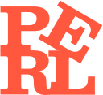

{:class="logo"}

# Philadelphia Perl Mongers

Once a month, we meet and someone gives a presentation about technical
issues about Perl, or the world surrounding Perl. Past talks include JSON,
Perl 6, Perl in the real world, Regular Expressions, and more. Generally
our speakers come from within phl.pm, but from time to time we bring in
a guru from elsewhere in the Perl community.

## Meetup page
All of our meetings are listed on [our meetup page](https://www.meetup.com/Philadelphia-Perl-Mongers/).

## Next meeting

<ul id='next_event'></ul>

## Past meetings
* 2017-05-08: Mark Dominus: the best anagrams
* 2017-04-10: Website hackathon
* 2017-03-13: Brian Duggan: Perl 6 CLI and metaprogramming
* 2017-02-13: Ricardo Signes: JMAP
* 2017-01-09: Curt Tilmes: GraphQL in Perl 6
* 2016-12-12: Jim Keenan: Devel::Git::MultiBisect
* 2016-11-14: Mark Dominus: Red flags
* 2016-10-10: Columbus Day
* 2016-09-12: Brian Duggan: Informal DSLs with Perl 6

## Mailing list
We have a rather low-volume
[mailing list](http://mail.pm.org/mailman/listinfo/philadelphia-pm),
used mostly for negotiation of meeting locations and occasional
technical chatter.

## Future dates

<ul id='future_events'></ul>

